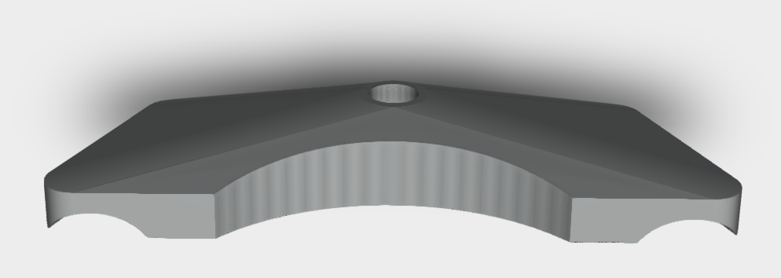

# Lectric XPedition Parts

## A collection of Lectric XPedition Parts
The XPedition is a wonderful cargo bicycle.  A few aspects of this bike, however, needed serious improvement.  Among them were:

  * Kickstand Top Plate (KTP) - [<code>kickstand.scad</code>](https://github.com/fpgirard/xpedition/blob/main/stl/kickstand.stl) - The OG Kickstand Top Plate (KTP).
  * Modifiable Feet for LT kickstand - [<code>haul-lt-feet.scad</code>](https://github.com/fpgirard/xpedition/blob/main/stl/haul-lt-feet20.stl) - Feet for the Specialized Haul LT kickstand.
  * Battery mounts - [<code>battery.scad</code>](https://github.com/fpgirard/xpedition/blob/main/stl/battery.stl) - 48V battery mount - Now you can mount batteries on a wall for charging or safe keeping.
  * Sturdy headlight mount - [<code>headlight-rad.scad</code>](https://github.com/fpgirard/xpedition/blob/main/stl/headlight-rad.stl) - Mount for the Ali Express headlight that works really well for the Rad front basket.
  * Blazing headlight [<code>LED-Panel.svg</code>](https://github.com/fpgirard/xpedition/blob/main/svg/LED-Panel.svg) - SVG file for laser cutting a clear lens for the AliExpress High Output LED Head Light.
  * Compression clasps - [<code>pannier.scad</code>](https://github.com/fpgirard/xpedition/blob/main/stl/pannier.stl) - Clasp for the XPedition pannier bag to allow the bag to be compressed.

This git directory layout is simple. In each of these directories, a separate <code>README.md</code> provides further details:
  * [<code>src</code>](https://github.com/fpgirard/xpedition/tree/main/src) has OpenSCAD source code that created the STL & STEP files
  * [<code>stl</code>](https://github.com/fpgirard/xpedition/tree/main/stl) contains exported <code>STL</code> and <code>STEP</code> files
  * [<code>svg</code>](https://github.com/fpgirard/xpedition/tree/main/svg) contains vector and .pdf files for laser cutting.
  * [<code>docs</code>](https://github.com/fpgirard/xpedition/tree/main/docs) has images, documents, schematics, and other supporting files

## Design
All designs are [<code>OpenSCAD</code>](https://openscad.org/) code. In the spirit of open-source, I've included these files so you can make the modifications _you_ want.  You will also need to use the [<code>BOSL2</code>](https://github.com/BelfrySCAD/BOSL2) library.  Except for the KTP, all of these components can be used as 3D printed parts, either as PLA or PETG.

For KTP, I used STL files to 3D print prototypes to measure fit/function. I was naive to think that I could submit these STLs to a machine shop and expect a reasonable price. The process is far more complicated and requires that one converts STL to a STEP-format (<code>kickstand.step</code>).   Using Autocad's Fusion360 mesh manipulation features, particularly <code>generate face groups</code> and <code>combine face groups</code>, I invested days to create a fully parametric STEP file from the original STL version. This repository includes both the STL and the resulting STEP file.  If you have access to a machine shop, submit the <code>kickstand1c.step</code> file.

[Matt DeHaan](https://www.facebook.com/matthew.alan.393) and I have a utility patent pending on the Kickstand Top Plate (KTP).   It was filed in the Patent & Trademark Office on April 4, 2024 under the Application Number 63/574,639 under the title "**FORCE NEUTRALIZING BICYCLE KICKSTAND TOP-PLATE**".

## Manufacturing
Pricing to 3D print and mill components can vary widely. Invest the time to get multiple quotes.

## Distribution
I've learned that Google Forms is a great way to get pre-orders.  [PirateShip.com](https://www.pirateship.com/) was a very elegant and affordable way to ship kits to customers.  Through the KTP Project, over 170 KTP kits have shipped worldwide.  In North America alone, it's been exciting to see [where these kits have landed](https://www.google.com/maps/d/edit?mid=1j4f2kwrzCzY-WC6AkdaDrvElPkuhrJU&usp=sharing)!

## Support
Huge shout out to [Matt DeHaan](https://www.facebook.com/matthew.alan.393), [Dusty Harrison](https://www.facebook.com/nosirrah.nitsud.leahcim), and [Bradley Crosby](https://www.facebook.com/bradleycrosby) for their unwavering support for KTP's development. 
